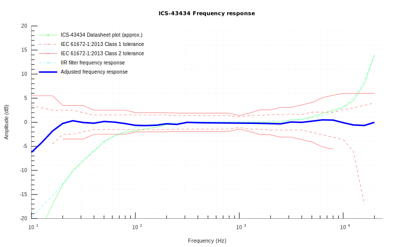

# Sound Level Meter with ESP32 and I2S MEMS microphone

Arduino/ESP32 Sound Level Meter (SLM) using inexpensive, factory calibrated, digital I2S MEMS microphone and digital IIR filters (vs. FFT) for equalization and weighting.

The basic idea is:

And the microphone response after equalization should look like:

Theoretically, i.e. with factory calibrated ICS-4343x, this should get you ±1dB(A) measurement within 20Hz-20KHz range.

The code in this repository is mostly intended as example how you can integrate reasonable noise measurement (i.e. *L*Aeq, Equivalent Continuous Sound Level) in your projects. 

You can find a bit more information in the [hackday.io](https://hackaday.io/project/166867-esp32-i2s-slm) project from [ikostoski](https://github.com/ikostoski/esp32-i2s-slm). 

This project is a fork. I developed a PCB, took the Arduino IDE compatible code and adapted it for the PCB design. Additionally, I created an ESPHome Config to perform long term measurements. 

The PCB got a WS2812B LED to draw attention with color and blinking codes. The Arduino code is already extended for this. 

There will be another new version of the PCB soon, as there are a few bugs. (5V instead of 3.3V, no switch, no battery voltage measurement, no shutdown, larger button... 

If you want to rebuild it, I would recommend you to wait for my new version or correct the errors yourself. Feel free to write to me if you want to do this! 